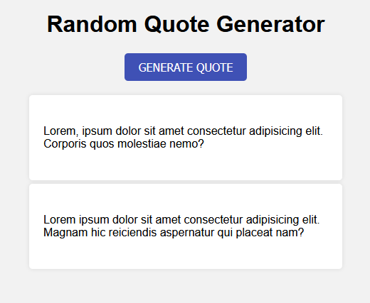

# Random Quote Generator 
In this task, we will use JavaScript to create a simple web page that generates random quotes. The user can click a button to generate a new quote, which will be displayed on the page.

## Instructions
1. Add event listener to `new-quote-button`.

2. Create an array of at least 5 quotes, each quote should be a `string`.

3. Use the random number to select a quote from the quotes array.

4. Create a `div` container with the `id` of `quote-container`.

5. Append the `quote-container` to the `quote-list` element.

6. Create a new `p` element and add the `id` property of `quote-text` to it.

7. Set the text content of the `quote-text` element to the selected quote.

8. Append the new `quote-text` to the `quote-container`.

9. Test your page to make sure the button generates a new quote each time it is clicked.

## Result Example
